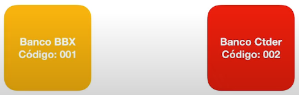
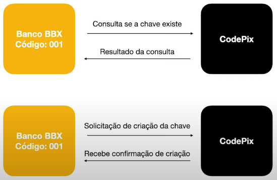
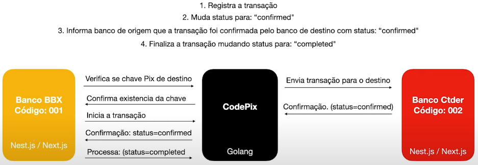
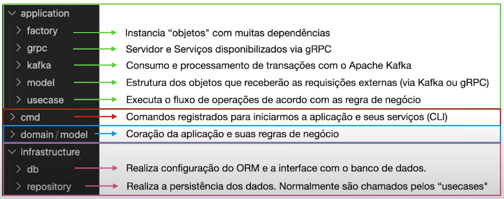

# Full Cycle, estudo de caso e microsserviços

> ## **Sobre o projeto**

- É uma solução de simulação de transferências de valores entre bancos fictícios através de chaves (email, CPF)

- Simulação de diversos bancos e contas bancárias que possuem uma chave Pix atribuída

- Cada conta bancária poderá cadastrar suas chaves Pix

- Uma conta bancária poderá realizar uma transferência para outra conta em outro banco utilizando a chave Pix da conta de destino

- Uma transação não pode ser perdida mesmo que: o _CodePix_ ou o banco de destino esteja fora do ar

> ## **Sobre os bancos**

- O banco será um microsserviço com funções limitadas à cadastro de contas e chaves Pix, bem como transferência de valores

- Utilização da mesma aplicação para a simulação de diversos bancos, mundo apenas cores, nome e código

> ## **Estrutura do projeto**

- Backend - Nest.js

- Frontend - Next.js

> ## **Sobre o _CodePix_**

- Intermediar as transferências bancárias

- Receber a transação de transferência

- Encaminhar a transação para o banco de destino (`Status: "pending"`)

- Receber a confirmação do banco de destino (`Status: "confirmed"`)

- Enviar a confirmação para banco de origem informado quando o banco de destino processar a transação em questão

- Receber a confirmação do banco de origem de que ele processou (`Status: "completed"`)

- Marcar a transação como completa (`Status: "completed"`)

> ## **Cadastro e consulta de chaves Pix**

> ## **Dinâmica do processo**

> ## **Desafios**

- Comunicação rápida e eficiência

  > Solução: gRPC

- Criação e consulta instantânea das chaves (síncrona)

  > Solução: gRPC

- Garantia de que nenhuma transação seja perdida, mesmo que qualquer um dos 3 sistemas esteja fora (assíncrono)

  > Solução: Apache Kafka

> ## **_CodePix_**

- Capaz de atuar como um servidor gRPC

- Consumir e publicar mensagens no Apache Kafka

- Ambas operações devem ser realizados de forma simultânea ao executar o serviço

- Trabalhar com um design focado em solucionar o problema do domínio

- Deixar a complexidade técnica para "camada de aplicação", responsável pelo servidor gRPC e Apache Kafka

- Flexível para a implementação de outros formatos de comunicação, como API Rest, CLI clients, sem precisar alterar nenhum outro componente da aplicação ou o modelo de domínio

> ## **Estrutura e camadas do _CodePix_**

